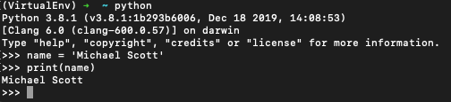

# Lesson 1

I want to jump out swinging, so first thing to do is run Python on the command line.  This is known as Python's Integrated Development and Learning Environment or IDLE.  IDLE allows you to run commands and see the results quickly and efficiently.

While this is a great way to start, IDLE is not ideal for creating larger programs.  There are many Integrated Development Environments (IDEs) available for this such as [PyCharm](https://www.jetbrains.com/pycharm/download/#section=mac), [Atom](https://atom.io/), [Spyder](https://www.spyder-ide.org/), etc. so choose one that you are comfortable with.  I'll be using [Visual Studio Code](https://code.visualstudio.com/download) for my examples and demonstrations.
