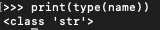

# Variable Types

In Lesson 1, we printed out some strings.  Some of those were typed by us and some of them were stored in variables.
Printing is useful for displaying information to the user and also for providing some quick feedback while troubleshooting.
We can see that our variables are strings by using the type() function.



> NOTE: In IDLE, you could just use ```type(name)``` but I want to get in the habit of using ```print(type(name))``` because I'll shortly be transitioning to the Visual Studio Code IDE where using ```type(name)``` will produce an error.

As you can see, our variable has a type of string.  What other variable types are there?  Python has five standard data types.  Let's take a quick look at all five. We'll cover them all over the course of the next few lessons.

* Strings
* Lists
* Dictionaries
* Tuples
* Numbers (more in depth below)


**Demonstration:**

Show examples of strings, lists, dictionaries and tuples and use ```type()``` to prove it.

> "Michael Scott"
>
> ["Michael Scott", "Dwight Schrute", "Angela Martin"]
>
> {"name": "Michael Scott", "title": "Regional Manager", "branch": "Scranton"}
>
> ("Michael Scott", "Dwight Schrute")

# Numbers

There are three different types of numbers:

* int (integers)
* float (floating point numbers)
* complex (complex numbers)

> NOTE: long was a number type in Python2 but has been deprecated in Python3

Integers are whole numbers and floats have a decimal point.

Integers:

* 1
* -4774197410171071081052052375
* 9088923958730527

Floats:

* 1.01
* -8.28280588973498572984569823645
* 7.2472722782958

Complex Numbers:

From what I've read, they're imaginary.  They have a j at the end like this, 4.7j.
> print(type(4.7j))
>
> <class 'complex'>

Maybe some of you will find a use for them if you're into advanced mathematics but I've personally never used them.

**Demonstration:**

Perform some basic calculations using integers and floats.  
Perform calculations using integers with strings.

**Assignment:**

Use the print statement and variables from Lesson 1.  Add add age variable.  Add your age to the print statement and how old you were when you started your job using variable with a calculation.

Example:

> Hello, my name is Dwight Schrute. I'm the Assistant to the Regional Manager at Dunder Mifflin and have been working here for 12 years.  I am currently 37 years old and started at Dunder Mifflin when I was 25 years old.
